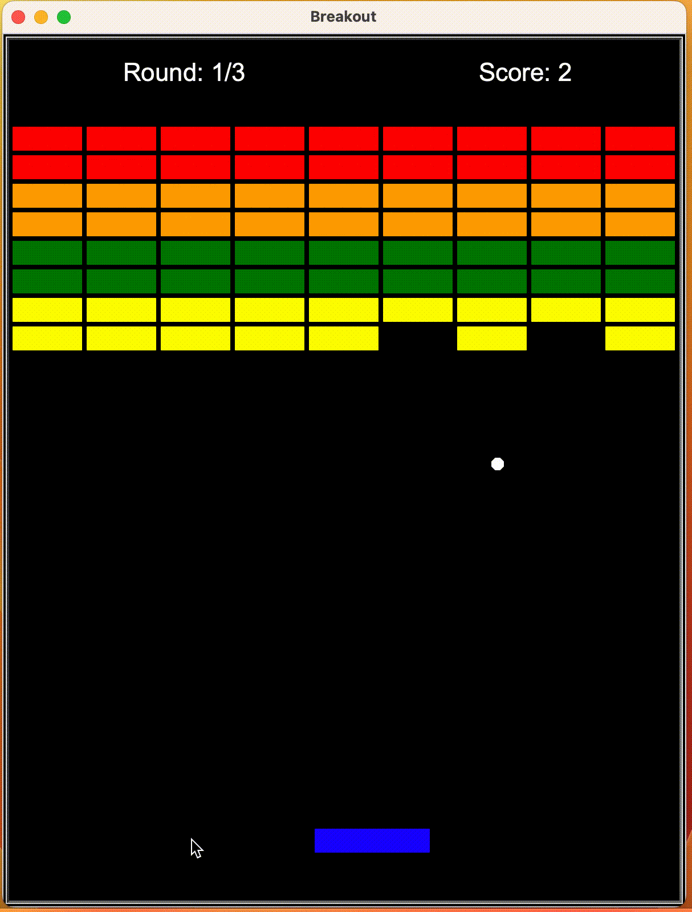

# Breakout Game

This repository contains a Python implementation of the classic Breakout game using the Turtle graphics library. The game consists of several components, each implemented in a separate Python file.



## Features

- Control a paddle at the bottom of the screen to bounce a ball and destroy bricks.
- Earn points by breaking bricks and try to achieve the highest score.
- Different colors of bricks have different scores, providing varying challenges and strategies.
- Different levels of difficulty to challenge your skills.
- Interactive scoreboard to track your progress.

## Installation

Clone the repository to your local machine:

```bash
git clone https://github.com/your-username/breakout-game.git
```

## How to Play

1. Run the main.py file:

```bash
python main.py
```

2. Use the left and right arrow keys to move the paddle and prevent the ball from falling off the screen.

3. Break all the bricks with the ball to complete each level.

4. Try to achieve the highest score possible by strategically bouncing the ball and breaking the bricks.

5. If the ball misses the paddle and hits the bottom of the screen, you lose a life. The game continues until you have no lives left.

🎉 Enjoy the game and have fun!

## Contributing

Contributions are welcome! If you have any ideas or improvements, feel free to open an issue or submit a pull request.

## Acknowledgements

- [Python Turtle Graphics](https://docs.python.org/3/library/turtle.html) - The graphics library used for creating the game.
- [Wikipedia - Breakout (video game)](<https://en.wikipedia.org/wiki/Breakout_(video_game)>) - Background information on the Breakout game.
